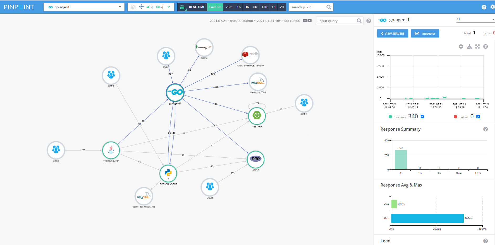
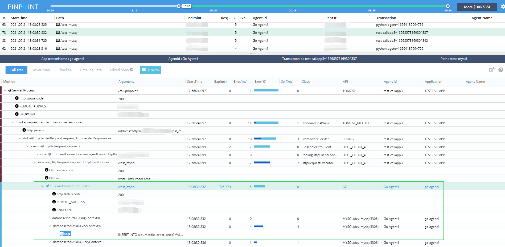

## Getting Started

### Pre-requirement

- [ ] Collector-Agent is online ( [How to?](https://github.com/pinpoint-apm/pinpoint-c-agent/tree/master/DOC/collector-agent#install-collector-agent)).
- [ ] [pinpoint-c-agent](https://github.com/pinpoint-apm/pinpoint-c-agent) common library is installed( [How to?](https://github.com/pinpoint-apm/pinpoint-c-agent/tree/master/DOC/common#install-pinpoint_common)).
- [ ] Adapting [Golang Concurrency Patterns](https://blog.golang.org/context#TOC_4.). ⭐


### Quicklystart

1. Add `pinpoint.go` under the root of your project.
    pinpoint.go
    ```
    package main
    
    // only import libs you cared
    
    import (
        "github.com/pinpoint-apm/go-aop-agent/common"
        _ "github.com/pinpoint-apm/go-aop-agent/libs/example"
        _ "github.com/pinpoint-apm/go-aop-agent/libs/httpClient"
        _ "github.com/pinpoint-apm/go-aop-agent/libs/mongo"
        _ "github.com/pinpoint-apm/go-aop-agent/libs/redisv8"
        _ "github.com/pinpoint-apm/go-aop-agent/libs/sql"
    )
    
    func init() {
        init_pinpoint()
    }
    
    func init_pinpoint() {
        common.Pinpoint_enable_debug_report(true) //open pinpoint debug log
        common.Pinpoint_set_collect_agent_host("tcp:127.0.0.1@9999") // set the collector agent(Installed in step of `Install Collector Agent`), it should be consistent with `PP_ADDRESS`
        common.Pinpoint_set_trace_limit(10) // set the sample rate: `-1`: not limit, all requests with be sampled. `0`: not sample, no requets will be sampled. `n`: n requests will be sampled every seconed.
        common.Appname = "go-agent1" // set Appname
        common.Appid = "Go-Agent1" // set Appid
    }

    ```
2. Import pinpoint middleware into your project(`mux` framework for example):
    ```
    package main
    ...
    import (
    ...
	pinpoint "github.com/pinpoint-apm/go-aop-agent/middleware/mux"
    )

    router := mux.NewRouter()
	// add pinpoint middleware
	router.Use(pinpoint.PinpointMuxMiddleWare) // <-- add middleware
    ...
    ```

3. At last, execute `go mod tidy`.

### ServerMap and callstack 

> pinpoint,supports distributed tracking

#### java-go-php-py-server-map



#### Callstack



### Framework, library supported

Library | Version
:---: | :---:
[net/http] | ~
 [mongo-driver/mongo]| v1.5.3
 [coreos/etcd/clientv3] |v3.3.25+incompatible
 [go-redis/redis/v8]| v8.11.0
 [database/sql]| ~

Framework (middleware)| Version
---|-----
[mux](https://github.com/gorilla/mux) | ~
[echo](https://github.com/labstack/echo)| v3.3.10+incompatible
[echo](https://github.com/labstack/echo)| v4.3.0


> More libraries and frameworks is coming soon. Welcome for contribution and suggestion. 

## TestApps

Example of `mux` and `echo` [testapp](./testapps)

## License
This project is licensed under the Apache License, Version 2.0.
See [LICENSE](LICENSE) for full license text.

```
Copyright 2020 NAVER Corp.

Licensed under the Apache License, Version 2.0 (the "License");
you may not use this file except in compliance with the License.
You may obtain a copy of the License at

    http://www.apache.org/licenses/LICENSE-2.0

Unless required by applicable law or agreed to in writing, software
distributed under the License is distributed on an "AS IS" BASIS,
WITHOUT WARRANTIES OR CONDITIONS OF ANY KIND, either express or implied.
See the License for the specific language governing permissions and
limitations under the License.
```
